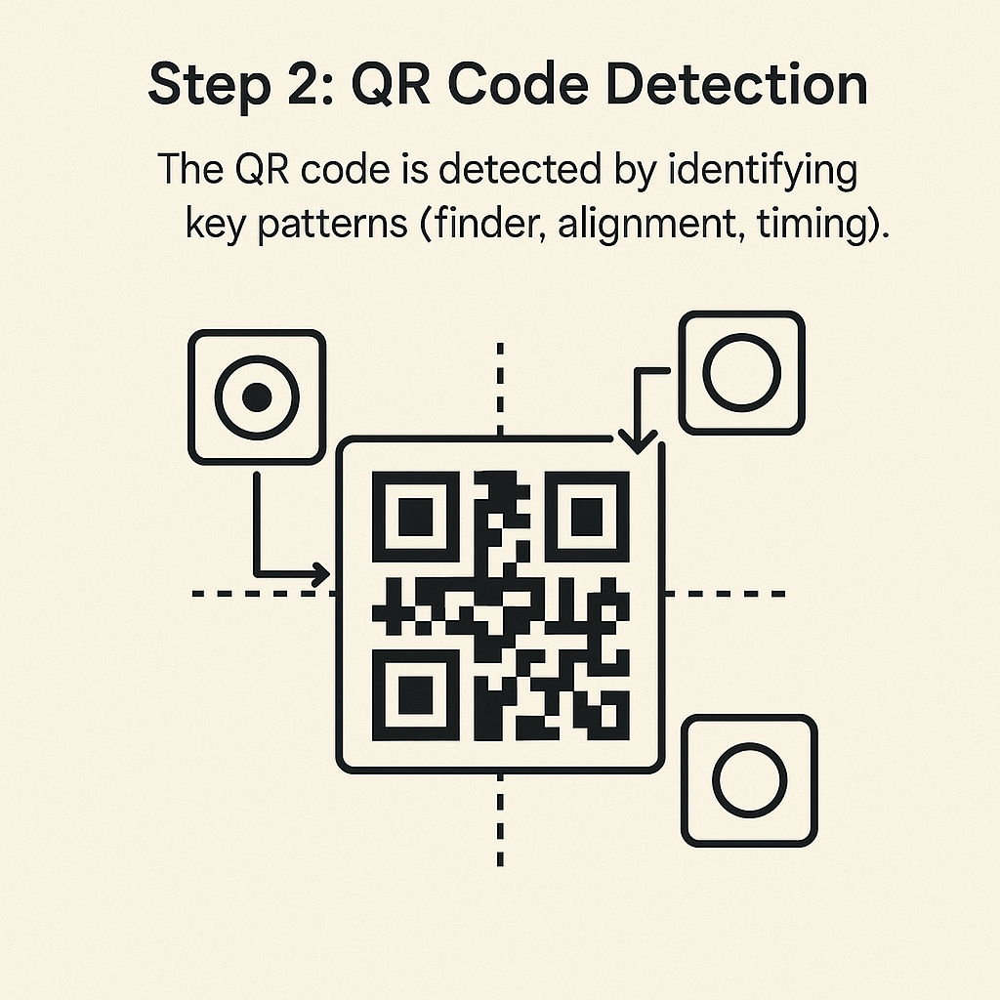
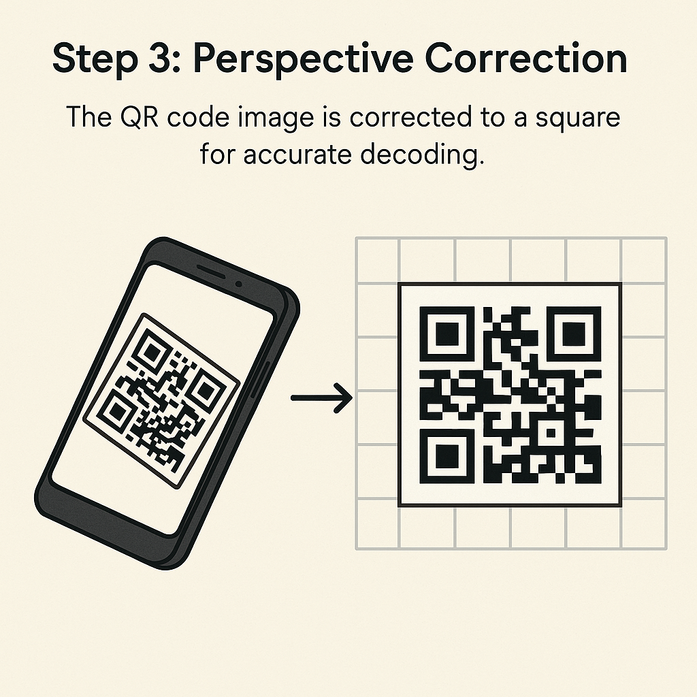
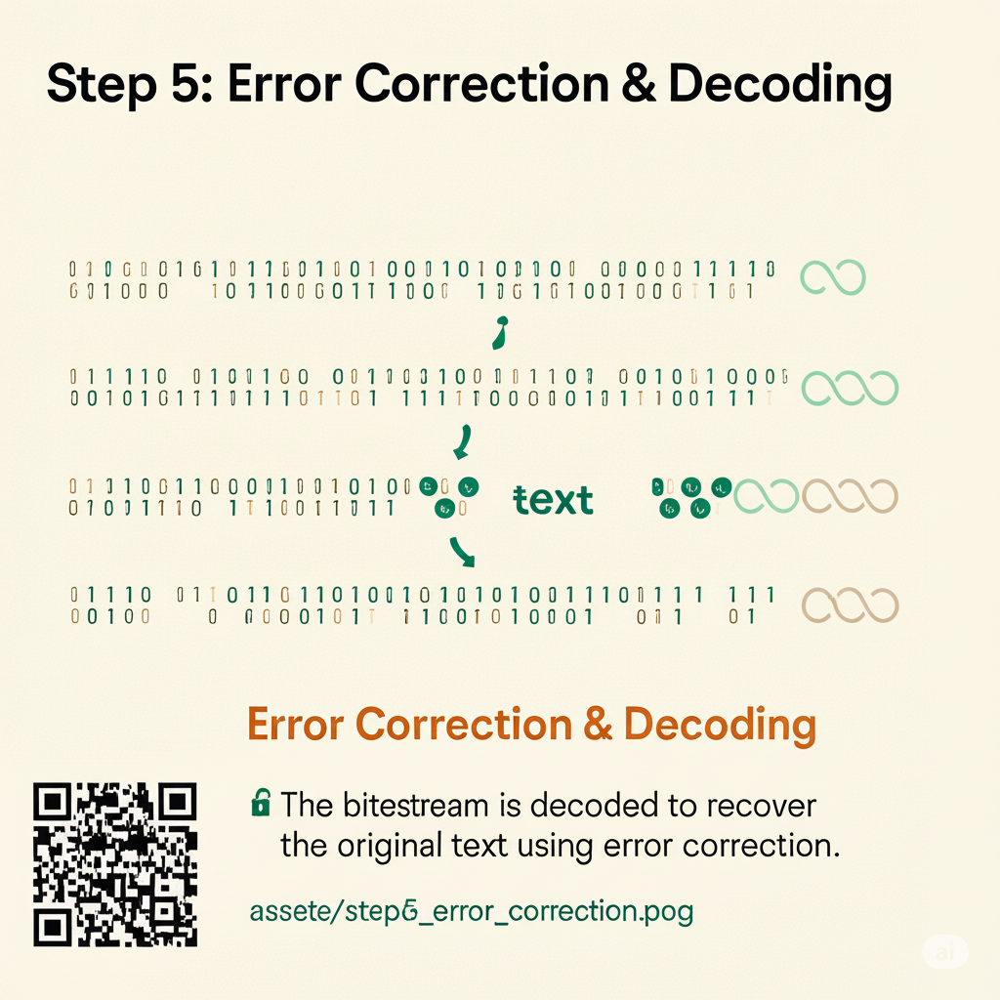

# 🔳 qrflow — Learn How QR Codes Work (Visually)

Ever wondered how your phone *actually* reads a QR code?  
**qrflow** is a visual and interactive app that teaches you **step-by-step how QR codes are scanned and decoded**, from camera capture to data extraction.

Built with ❤️ using [Streamlit](https://streamlit.io), it's ideal for students and curious developers learning computer vision or cryptography basics.

---

## 🎯 Features

- 🔧 Generate QR codes from text or URLs
- 📷 Simulate how phone cameras scan QR codes
- 🧠 Visual explanation of each internal step:
  - Camera capture
  - Pattern detection
  - Perspective correction
  - Bitstream extraction
  - Error correction
- 👁️ Educational illustrations for each stage
- 📥 Download generated QR codes
- ✅ Final decoded result shown live

---

## 🖼️ Preview

| Step | Description |
|------|-------------|
|  | Camera captures the QR code |
|  | Finder & alignment pattern detection |
|  | Perspective correction for grid extraction |
|  | Extracting raw bitstream |
|  | Error correction and decoding |

---

## 🚀 Getting Started

### 1. Clone the Repository

```bash
git clone https://github.com/your-username/qrflow.git
cd qrflow
````

### 2. Install Dependencies

```bash
pip install -r requirements.txt
```

### 3. Launch the App

```bash
streamlit run app.py
```

---

## 🛠️ Tech Stack

* Python 🐍
* Streamlit 🎈
* OpenCV
* NumPy
* Pillow (PIL)
* [Nayuki’s QR Code Generator](https://github.com/nayuki/QR-Code-generator)

---

## 👨‍🏫 Who’s It For?

* Students learning computer vision or cryptography
* Python beginners curious about how QR scanning works
* Developers building scan-related apps or tools

---

## 👨‍💻 Author

Built with care by **Nachiket Kapure**
📫 [nachiketkapure01@gmail.com](mailto:nachiketkapure01@gmail.com)
🔗 [GitHub](https://github.com/Nachiket1904) | [LinkedIn](www.linkedin.com/in/nachiket-kapure-ml-enginner)

---

